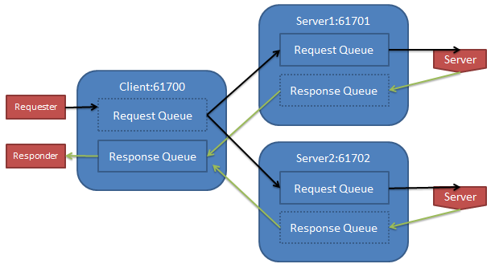

activemq-bug-reports
====================

Isolated reproductions for activemq bugs

## Network Connectors fail when Memory Usage exceeded

Test Class: [NetworkForwardingTest](/broker-network-tests/src/test/java/com/sensus/activemqtests/NetworkForwardingTest.java)

### Test Setup:

A 3 broker system where all applications connect to a single local broker. The requester application sends messages to
the request queue which are then "processed" by the server application who sends the processed values to a response queue
which are then consumed by the responder application. The client will produce 1 million messages and wait for all the
responses to consider the test a success.

Other configuration settings of interest:

* Producer flow control is off
* Broker is configured to have no persistence
* Application Connections are using asyncSend and asyncDispatch
* All message senders use JmsTemplate with CachingConnectionFactory and ttl = 60 and persistent = false

### Diagram:



### Bug description:

If the configured MemoryStore limit is large enough to stay below 100% while the requestor application is dumping
messages into the broker network the tests passes successfully. If however the memory usage on the brokers goes
larger than 100% (in this case peaking around 600% of 100 Mb) the network connectors sometimes become "stuck". Stuck in
this case means there are messages enqueued on one or both of the "server" brokers but the messages are not being
dequeued or forwarded by the network connector back to the "client" broker.

This issues doesn't happen with every run with a small memory size but in my tests it generally failed about 50% of the
times I tried running it. You may have to run it a few times before getting it to fail. On one failure JMX showed that
417k responses had been generated on server1 but only 363k had been dequeued for transmission to the client broker. In
that test run the other server had correctly handled the other 583k requests.

When it does fail there is nothing in the log that indicates anything is amiss. I would have expected to see some sort
of log message to indicate that the network connector has been throttled (if indeed that is what is happening). This same
test done with a single broker always passes which leads me to believe it really is a problem with the network connectors.

Interestingly I sometimes see these sorts of log messages when running with low memory usage but everytime I have had
seen them it seems to pass the test.

```
2014-12-30 16:45:31,412 [iveMQ BrokerService[server2] Task-4] WARN  AbstractStoreCursor            - org.apache.activemq.broker.region.cursors.QueueStorePrefetch@9e4d110:request-queue,batchResetNeeded=false,storeHasMessages=true,size=122,cacheEnabled=false,maxBatchSize:122,hasSpace:true - cursor got duplicate: ID:MOC-L-1HENDLEYS-54282-1419975922250-11:2:1:1:22536, 4
2014-12-30 16:45:31,413 [iveMQ BrokerService[server2] Task-4] WARN  AbstractStoreCursor            - org.apache.activemq.broker.region.cursors.QueueStorePrefetch@9e4d110:request-queue,batchResetNeeded=false,storeHasMessages=true,size=122,cacheEnabled=false,maxBatchSize:122,hasSpace:true - cursor got duplicate: ID:MOC-L-1HENDLEYS-54282-1419975922250-11:2:1:1:22537, 4
2014-12-30 16:45:31,413 [iveMQ BrokerService[server2] Task-4] WARN  Queue                          - duplicate message from store ID:MOC-L-1HENDLEYS-54282-1419975922250-11:2:1:1:22277, redirecting for dlq processing
2014-12-30 16:45:31,414 [iveMQ BrokerService[server2] Task-4] WARN  Queue                          - duplicate message from store ID:MOC-L-1HENDLEYS-54282-1419975922250-11:2:1:1:22281, redirecting for dlq processing
```

### Fixes?

* Ideally the network connectors wouldn't fail like this, that would be best case scenario
* If we can't fix issues it would be good to have much "louder" logging messages when the broker is running in this sort
  of mode. We ran in this mode for a long period before we noticed these "stuck" network connectors. I'm
  still not sure what the semantics of Max memoryUsage is when those values aren't respected and it allows filling to 100s
  or 1000s of times the limits and then failing in a surprising way.
